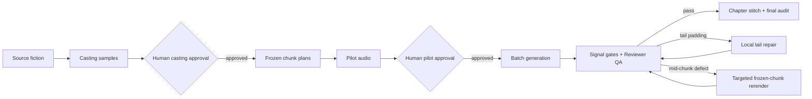

# Seed Audiobook Generator

**A QA-gated, resumable multi-character Audio Drama production pipeline — not an ebook-to-TTS converter.**

It turns fiction into a controlled production run: stable casting, frozen scene inputs, representative pilots, resumable batch rendering, chunk-level audio repair, and chapter-level acceptance. The output is mixed narration, dialogue, ambience, and source-motivated SFX; composed background music is disabled by default because it does not stitch reliably across independently generated chunks.

## Listen to the demo

This is a 16-minute generated audio-drama pilot (`demo.wav`, 24 kHz WAV) supplied for this repository's public demonstration.

<audio controls preload="metadata">
  <source src="assets/demo.wav" type="audio/wav">
  Your browser does not support embedded audio. Download the file from the link below.
</audio>

[Download or open the demo audio (WAV, 91 MB)](assets/demo.wav)

The demo is intentionally a checked-in showcase asset. Production outputs remain git-ignored by default because they may contain customer text, are costly to reproduce, and are governed by the provider's retention policy.

The bundled input is [`examples/moonlit_cloister_source.txt`](examples/moonlit_cloister_source.txt), an original English magic-duel scene. A completed run keeps all source-to-output evidence together:

```text
outputs/skill_runs/<run-id>/
├── inputs/                         # frozen source, casting, and story config
├── sections/section_*/
│   ├── 06_generation_requests/     # exact per-chunk Seed Audio prompts
│   ├── 07_audio_parts/             # accepted WAV chunks and revisions
│   └── logs/chunk_delivery/         # technical + reviewer decisions
├── stitched/<run-id>_full.wav       # chapter audio
└── logs/final_chapter_audit.json    # final timeline audit
```

To create and inspect your own pilot, run the Quick Start flow through Pilot, then open the WAV files under `outputs/skill_runs/<run-id>/sections/*/07_audio_parts/`.

## Why not direct Seed Audio?

| Direct one-shot TTS / Seed Audio call | This production pipeline |
| --- | --- |
| Voice assignment lives inside each prompt. | A reviewed role registry freezes character-to-voice binding across the run. |
| Long text is sent as an unstructured request. | Source is segmented into bounded, traceable chunks with immutable source ranges. |
| Quality is judged after the fact. | Casting and representative pilots require human approval before batch cost is incurred. |
| A failed render usually means retrying or editing the whole request. | Failed audio is isolated to the same frozen chunk; tail padding is repaired locally, while true mid-chunk defects are queued for targeted rerender. |

## Workflow



The audio phase does **not** structurally replan text, casting, or chunk boundaries. It repairs the WAV or rerenders the original frozen chunk. Structural replan is reserved for planning-stage input defects.

## Models and access

This is an orchestration workflow, not a bundled model distribution. Start in the [BytePlus ModelArk Console](https://console.byteplus.com/ark/region:ark+ap-southeast-1) to enable the models available to your tenant; create the Ark credential from the [API key page](https://console.byteplus.com/ark/region:ark+ap-southeast-1/apikey). The default model roles are deliberately configurable in [`.env.example`](.env.example):

| Workflow role | Default model | What it does | Where to obtain access |
| --- | --- | --- | --- |
| Planning and prompt compilation | `dola-seed-2-1-turbo-260628` | Reads the novel, proposes roles and frozen chunks, and compiles render contracts. | Enable the model in your BytePlus ModelArk tenant, then create an Ark API key and use the tenant's OpenAI-compatible base URL. |
| Audio rendering | `seed-audio-1.0` | Generates the multi-role speech, ambience, and SFX audio for each frozen chunk. | Request/enable Seed Audio in the BytePlus console or through your BytePlus account team; create a Seed Audio credential and use the provisioned regional endpoint. |
| Optional dry voice references | `seed-tts-2.0` | Creates a reference voice only when a role is configured with `reference_mode=tts_audio`. | Enable Seed TTS in the same tenant. Most fixed-speaker runs do not require it. |
| Listening review | `seed-2-0-lite-260428` | Reviews a generated chunk and its boundary context for speech defects and delivery issues. | Enable it in ModelArk and configure the same Ark-compatible planning/review credentials. |

Model names and availability are tenant- and region-dependent. If your account exposes different endpoint IDs, set `SEED_AUDIO_REWRITE_MODEL`, `SEED_AUDIO_MODEL`, `TTS_RESOURCE_ID`, and `SEED_AUDIO_REVIEW_MODEL` in `.env` rather than editing workflow code. The configured URLs in the template are Asia-Pacific examples, not universal endpoints.

To set up access, copy the template, populate only the capabilities used by your run, and keep the real file local:

```bash
cp .env.example .env
# Add Ark credentials for planning/review and Seed Audio credentials for rendering.
# Add TTS credentials only if you opt into generated dry voice references.
```

## Quick Start

`scripts/audio_drama_skill.py` is the only user-facing runner.

```bash
python3 -m venv .venv
source .venv/bin/activate
python3 -m pip install --upgrade pip
python3 -m pip install -r requirements.txt

# ffmpeg must be installed and available on PATH.
ffmpeg -version

python3 scripts/audio_drama_skill.py run \
  --source-file examples/moonlit_cloister_source.txt \
  --source-title "Moonlit Cloister Duel" \
  --run-id moonlit_demo_001
```

The runner stops after casting. Listen to the generated role samples, then explicitly continue:

```bash
python3 scripts/audio_drama_skill.py approve-casting --run-id moonlit_demo_001
python3 scripts/audio_drama_skill.py resume --run-id moonlit_demo_001

# The run stops again after representative pilots.
python3 scripts/audio_drama_skill.py approve-pilot --run-id moonlit_demo_001
python3 scripts/audio_drama_skill.py resume --run-id moonlit_demo_001
```

Check a run without calling a provider:

```bash
python3 scripts/audio_drama_skill.py status --run-id moonlit_demo_001
```

For tests, install `python3 -m pip install -r requirements-dev.txt` and run `python3 -m pytest tests -q`.

## What this is — and is not

| Project type | Primary job |
| --- | --- |
| ebook2audiobook-style project | Converts text into speech audio, typically as a direct TTS workflow. |
| Seed Audiobook Generator | Orchestrates generative audio-drama production: casting governance, prompt compilation, human gates, resumability, QA evidence, targeted repair, and final chapter acceptance. |

This project still uses Seed Audio to render speech and mixed audio. Its value is the production control and quality system around the model call, not a claim to replace the model.

## Current limits

- Designed and tested for **English fiction**; other languages require explicit voice, phonetic, and QA validation.
- Requires valid Seed Audio and Ark-compatible planning credentials for real generation. Never commit `.env`.
- Full production requires **two human approvals**: casting and pilot.
- Independent mixed audio renders cannot guarantee continuous background music. This workflow defaults to voice, ambience/room tone, and necessary SFX without composed score beds.
- A final accepted chapter is an audio delivery decision, not a claim that every model render is flawless; the run preserves prompts, reviews, revisions, and timeline audit evidence for follow-up.

## Configuration and outputs

Use [`.env.example`](.env.example) as the safe setup template; [`references/env.example`](references/env.example) and [`references/env-vars.md`](references/env-vars.md) list the extended configuration surface. `ffmpeg` is required for WAV validation, tail trimming, and stitching.

All generated source copies, prompts, provider responses, audio revisions, QA reports, events, and run state go under `outputs/skill_runs/<run-id>/`. These artifacts and credentials are ignored by git.

For workflow semantics and operator commands, read [SKILL.md](SKILL.md), [workflow v2](references/workflow-v2.md), and the [final workflow reference](references/final-workflow.md).
