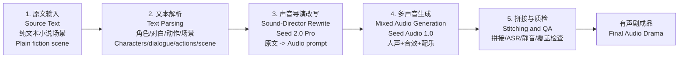
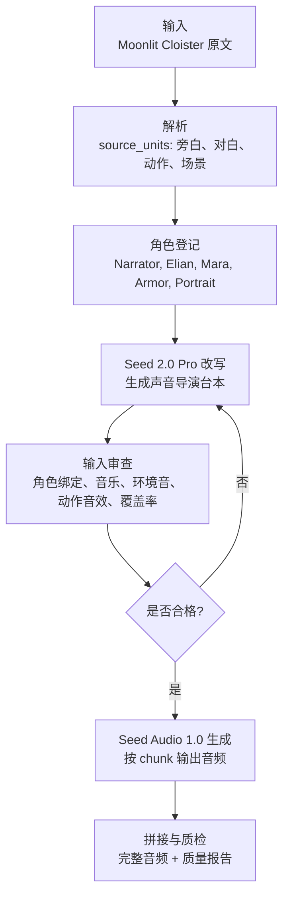
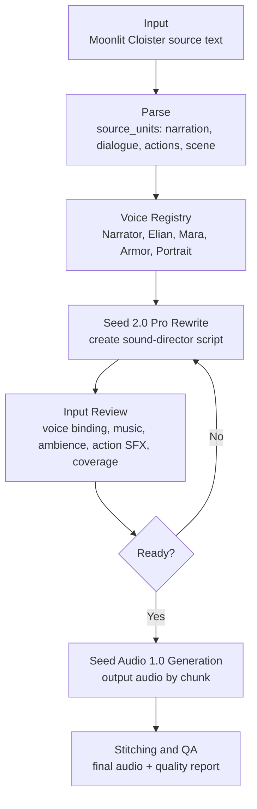

# Seed Audio 1.0 端到端方案 v2 - 魔法决斗片段自动变有声剧
# Seed Audio 1.0 End-to-End Solution v2 - Turning a Magic Duel Scene into an Audio Drama

> 面向产品介绍、demo 展示和接入最佳实践：这份文档说明如何把一段纯文本小说场景，自动改写成 Seed Audio 1.0 可执行的声音导演台本，并生成多角色、有环境音、有动作音效、有配乐氛围的有声剧片段。  
> For product introduction, demo presentation, and integration best practices: this document explains how a plain-text fiction scene can be converted into a Seed Audio 1.0-ready sound-director script, then generated as an audio drama with multiple characters, ambience, action SFX, and musical atmosphere.

## 方案简介<br>Solution Summary

这套方案交付的是一条从“纯文本小说片段”到“多角色有声剧成品”的端到端工作流：用户只输入原文，工作流自动解析剧情、角色、对白、动作和场景声音，再由 Seed 2.0 Pro 改写成 Seed Audio 1.0 可执行的声音导演 prompt，最后由 Seed Audio 1.0 生成包含旁白、角色对白、环境音、动作音效和配乐氛围的音频。本版相比初版的关键改进，是把 demo case 换成更适合展示多声音混合能力的英文魔法决斗片段 `The Duel in the Moonlit Cloister`，并补齐角色音色登记、reference audio、`<<TGT_SPK1>>/<<TGT_SPK2>>/<<TGT_SPK3>>` 槽位绑定、输入审查和产物管理，让流程更接近可复现的产品 demo，而不是一次性手写 prompt。  
This solution delivers an end-to-end workflow from a plain-text fiction passage to a multi-character audio-drama output. The user only provides the source text; the workflow automatically parses story beats, characters, dialogue, actions, and soundscape elements, then uses Seed 2.0 Pro to rewrite the passage into a Seed Audio 1.0-ready sound-director prompt. Seed Audio 1.0 then generates narration, character dialogue, ambience, action SFX, and musical atmosphere. Compared with the initial version, this version uses the English magic-duel scene `The Duel in the Moonlit Cloister`, which better demonstrates mixed sound-scene generation, and adds voice registry, reference audio, `<<TGT_SPK1>>/<<TGT_SPK2>>/<<TGT_SPK3>>` slot binding, input review, and artifact management, making the flow closer to a reproducible product demo instead of a one-off hand-written prompt.

## 一、端到端全景<br>1. End-to-End Overview

### 1.1 原文与生成音频<br>1.1 Source Text and Generated Audio

第一屏先展示用户输入和最终结果：左边是原始小说片段，右边是本次工作流生成的音频。这样可以直接说明产品价值：**用户输入的是普通小说文本，输出是可播放的有声剧片段。**  
The first view should show the user input and the final result: the original fiction passage on the left and the generated audio on the right. This makes the product value immediately clear: **the user provides ordinary fiction text, and the system outputs a playable audio-drama scene.**

**原文<br>Source Text**

```text
Moonlight spilled across the abandoned cloister. The old portraits kept their eyes shut, pretending not to watch. Elian Vale stood by the broken fountain, wand raised. Mara Voss stepped from the archway with green sparks crawling over her knuckles. Mara: "You should have stayed in the library, Vale." Elian: "And miss your midnight villain speech? Never."

Mara slashed her wand through the air. Mara: "Serpenshade!" Black smoke twisted into a serpent and struck the pillar beside Elian. Elian: "Luminara Fang!" White-gold light shattered the creature into sparks.

The portraits gasped awake. Old Portrait: "Highly improper spellwork after curfew!" Mara drove forward, fury sharpening her voice. Mara: "You think jokes will save you?" Elian tried to answer, but the stone floor groaned under invisible weight.

Elian forced his wand upward. Elian: "Featherbound!" The pressure snapped away, flinging him backward into a suit of armor. Armor: "State your business!" Elian: "Trying not to die!"

Mara fired a red bolt down the corridor. Elian rolled behind the armor as the blast tore the helmet clean off. Armor: "Rude." Elian spun his wand and split into three shimmering copies. Mara: "Clever."

Mara's eyes flashed blue. Two false Elians burst like soap bubbles. The real Elian was already beside the stained-glass window. Elian: "Too slow." He pointed at the moonlit glass. Elian: "Prismatica!" Reflected beams scattered across shields, frames, and wet stone.

Mara shielded her eyes. Elian: "Vincula Argentum!" Silver cords snapped around Mara's wrist, waist, and ankles, and her wand clattered away. Old Portrait: "Ten points for technique. Fifty off for property damage." Elian kept his wand trained on Mara. Elian: "Now tell me where you hid the star-key."

Mara smiled. Behind Elian, the headless armor bent down and picked up Mara's wand. Its empty neck turned toward him. Armor: "Apologies. I appear to be cursed." The armor raised the wand, and the cloister fell into a sudden silence.
```

**生成音频<br>Generated Audio**

飞书文档中请直接播放下方音频附件。  
In the Feishu document, play the attached audio directly.

### 1.2 工作流全景<br>1.2 Workflow Overview

整条链路分为 5 步。最核心的模型能力是第 4 步：**Seed Audio 1.0 根据一个声音导演 prompt，同时生成角色对白、旁白、环境音、动作音效和音乐氛围**。其余步骤是为了让模型输入稳定、可控、可复现。  
The pipeline has five steps. The core model capability is Step 4: **Seed Audio 1.0 generates character dialogue, narration, ambience, action SFX, and music from a single sound-director prompt**. The other steps make the model input stable, controllable, and reproducible.



| 步骤<br>Step | 谁做<br>Owner | 性质<br>Type | 关键点<br>Key Point |
| --- | --- | --- | --- |
| 1. 原文输入<br>Source input | 用户<br>User | 输入<br>Input | 只需要小说原文，不要求人工写音效<br>Only plain fiction text is needed; no manual SFX annotation required |
| 2. 文本解析<br>Text parsing | 工作流<br>LLM | 自动化<br>Automation | 拆解旁白、对白、动作、场景、情绪和角色<br>Extract narration, dialogue, actions, scene, emotion, and characters |
| 3. 声音导演改写<br>Sound-director rewrite | Seed 2.0 Pro | 文本生成<br>Text generation | 生成 Audio 1.0 友好的时间线 prompt<br>Produce an Audio 1.0-friendly chronological prompt |
| 4. 多声音生成<br>Mixed audio generation | Seed Audio 1.0 | 核心模型能力<br>Core model capability | 一段 prompt 生成多角色、人声、环境音、动作音效、配乐<br>Generate multiple voices, ambience, SFX, and music from one prompt |
| 5. 拼接与质检<br>Stitching and QA | 工作流<br>Workflow | 工程<br>Engineering | 统一文件夹管理，检测文本覆盖、静音、时长、ASR 内容<br>Manage outputs and check coverage, silence, duration, and ASR content |

方案关键判断：  
Key product judgments:

- **Seed Audio 1.0 的差异化在“混合声音场景生成”<br>Seed Audio 1.0 differentiates through mixed sound-scene generation**：不是只做 TTS 朗读，而是把一段声音导演台本演成完整声音场景。  
  It is not just TTS reading; it performs a sound-director script as a complete audio scene.
- **工作流的价值是把普通小说变成合格输入<br>The workflow turns ordinary fiction into qualified model input**：角色、音色、配乐、环境、动作音效都要从原文自动分析出来。  
  Characters, voices, music, ambience, and action SFX should be inferred from the source text.
- **不能把一整段小说原文直接塞给 Audio 1.0<br>Do not feed the raw chapter directly into Audio 1.0**：更稳的方式是先做剧情级和声音级改写，再生成。  
  The more stable approach is to rewrite it into a story-aware and sound-aware performance prompt first.

## 二、真实样例<br>2. Real Demo Case

样例选择：  
Sample selection:

- 作品<br>Work: `The Duel in the Moonlit Cloister`
- 语言<br>Language: 英文<br>English
- 来源属性<br>Source type: 自创 demo 文本，可安全用于产品演示<br>Original demo text, safe for product demonstration
- 场景价值<br>Scene value: 月夜回廊、魔杖决斗、咒语、画像、盔甲、反转结尾，天然包含人声、动作音效、环境音和配乐空间<br>A moonlit cloister, wand duel, spells, portraits, armor, and a twist ending, naturally covering voices, action SFX, ambience, and music

### 2.1 原文输入<br>2.1 Source Text

本次 demo 的完整原文已经放在第一章开头，便于和生成音频并排查看。这里强调一点：工作流的输入只需要这类纯文本，不需要人工预先标注音效、角色音色或配乐。  
The full source text is placed at the beginning of Section 1 so it can be viewed alongside the generated audio. The key point is that the workflow only needs plain text; it does not require manually annotated SFX, character voices, or music.

### 2.2 切分 + 角色音色映射<br>2.2 Chunking + Role-to-Voice Mapping

这个 case 的处理重点不是“为什么适合展示”，而是先把原文拆成可生成的剧情块，并把每个角色绑定到稳定音色。工作流先生成细粒度 `source_units`，再按戏剧动作合并成 Audio chunk；同时建立 `voice_registry`，保证同一角色跨 chunk 使用同一套 speaker、reference audio 和角色标记。  
The key step for this case is not just explaining why it is suitable, but splitting the source into generatable story chunks and binding each role to a stable voice. The workflow first creates fine-grained `source_units`, then merges them into Audio chunks by dramatic action. At the same time, it builds a `voice_registry` so each character keeps the same speaker, reference audio, and role marker across chunks.

| 分组<br>Chunk | 覆盖剧情<br>Story Coverage | 出场角色<br>Active Roles | 声音重点<br>Sound Focus |
| --- | --- | --- | --- |
| chunk 001 | 月夜回廊开场、Elian 与 Mara 对峙、第一次咒语交锋<br>opening in the moonlit cloister, Elian and Mara confront each other, first spell exchange | Narrator, Mara Voss, Elian Vale | 夜风、石墙回声、喷泉滴水、魔法火花、黑烟蛇、石柱碎裂<br>night wind, stone echo, fountain drip, magic sparks, smoke serpent, stone crack |
| chunk 002 | 重力咒、Featherbound、盔甲醒来、红色闪电、幻影、Prismatica、银索束缚<br>gravity spell, Featherbound, armor wakes, red bolt, illusion copies, Prismatica, silver binding | Narrator, Elian Vale, Guardian Armor | 地面压迫、盔甲金属声、红色冲击、幻影破裂、彩窗反射、银索<br>floor pressure, armor metal, red impact, illusion pop, stained-glass reflections, silver cords |
| chunk 003 | Mara 微笑、盔甲捡起魔杖、反转结尾<br>Mara smiles, armor picks up the wand, twist ending | Narrator, Guardian Armor | 音乐转低、金属弯折、魔杖拾起、突然静默<br>music drops, metal bends, wand pickup, sudden silence |

角色音色映射分为两层：第一层是全局角色音色表，固定每个角色使用哪个 speaker / reference voice；第二层是每个 Audio 1.0 请求内的 speaker 槽位绑定。`<<TGT_SPK1>>/<<TGT_SPK2>>/<<TGT_SPK3>>` 不是全局角色 ID，而是单次请求里的第 1、2、3 个参考音频槽位。  
The role-to-voice mapping has two layers: the global role registry fixes which speaker / reference voice each character uses, while each Audio 1.0 request binds active characters to in-request speaker slots. `<<TGT_SPK1>>/<<TGT_SPK2>>/<<TGT_SPK3>>` are not global character IDs; they are the first, second, and third reference-audio slots inside one request.

| 角色<br>Role | 声音定位<br>Voice Direction | speaker<br>参考音色<br>Reference Voice | 全局角色 ID<br>Global Role ID |
| --- | --- | --- | --- |
| Narrator | English fantasy audiobook narrator，清晰、悬疑、电影感但不过度表演<br>clear, suspenseful, cinematic but not overacted | `en_male_knightley_uranus_bigtts` | `role_narrator` |
| Elian Vale | 少年巫师，机智、紧张但嘴硬<br>teenage wizard, witty and tense but brave | `en_male_josh_uranus_bigtts` | `role_elian` |
| Mara Voss | 年轻女巫，锋利、愤怒、克制<br>young female wizard, sharp, furious, controlled | `en_female_rachel_p1_uranus_bigtts` | `role_mara` |
| Guardian Armor | 被施咒盔甲，金属感、正式、带一点喜剧<br>enchanted armor, metallic, formal, slightly comic | `en_male_hades_uranus_bigtts` | `role_armor` |
| Old Portrait | 年长画像巫师，古板、夸张、讽刺<br>elderly painted wizard, pompous, theatrical, dry | `en_male_ronald_uranus_bigtts` | `role_portrait` |

每个 chunk 只把本段真正出场的角色传入 Audio 1.0，并按参考音频顺序绑定槽位。这样可以满足单次请求最多 3 个参考音频的约束，同时保证同一角色跨 chunk 仍使用同一份音色资产。  
Each chunk only sends the roles that actually appear in that segment to Audio 1.0, then binds the slots according to the reference-audio order. This keeps each request within the three-reference limit while preserving the same voice asset for the same character across chunks.

| chunk | `<<TGT_SPK1>>` | `<<TGT_SPK2>>` | `<<TGT_SPK3>>` |
| --- | --- | --- | --- |
| chunk 001 | Narrator | Mara Voss | Elian Vale |
| chunk 002 | Narrator | Elian Vale | Guardian Armor |
| chunk 003 | Narrator | Guardian Armor | 不使用<br>unused |

## 三、自动改写工作流<br>3. Automatic Rewrite Workflow

当前工作流由一层自动化编排承载。它的职责不是只调用模型，而是完成整条生产链路：  
The current workflow is handled by an automation layer. Its job is not just to call the model, but to run the whole production pipeline:

**原文读取 -> 逐句结构化 -> 角色登记 -> Seed 2.0 Pro 改写 -> Audio 1.0 输入审查 -> 分段生成 -> 拼接 -> 质量分析。**  
**Source loading -> sentence-level structuring -> voice registry -> Seed 2.0 Pro rewrite -> Audio 1.0 input review -> chunk generation -> stitching -> quality analysis.**

### 3.1 工作流流程<br>3.1 Workflow Process

为了便于左右对照，这里先用两列表格呈现中文流程和英文流程；下方继续保留中文和英文两张完整流程图，便于单图查看。  
For side-by-side comparison, the Chinese and English workflows are first shown in a two-column table; the full Chinese and English flowcharts are kept below for single-chart viewing.

| 中文流程 | English Workflow |
| --- | --- |
| 输入：Moonlit Cloister 原文 | Input: Moonlit Cloister source text |
| 解析：生成 `source_units`，拆出旁白、对白、动作、场景 | Parse: create `source_units` for narration, dialogue, actions, and scene |
| 角色登记：Narrator、Elian、Mara、Armor、Portrait | Voice Registry: Narrator, Elian, Mara, Armor, Portrait |
| Seed 2.0 Pro 改写：生成声音导演台本 | Seed 2.0 Pro Rewrite: create the sound-director script |
| 输入审查：检查角色绑定、音乐、环境音、动作音效、覆盖率 | Input Review: check voice binding, music, ambience, action SFX, and coverage |
| 判断是否合格：不合格则返回改写层修正 | Readiness Gate: if not ready, return to the rewrite layer |
| Seed Audio 1.0 生成：按 chunk 输出音频 | Seed Audio 1.0 Generation: output audio by chunk |
| 拼接与质检：输出完整音频和质量报告 | Stitching and QA: produce final audio and quality report |





| 阶段<br>Stage | 本 case 的输入<br>Case Input | 本 case 的输出<br>Case Output | 作用<br>Purpose |
| --- | --- | --- | --- |
| 原文读取<br>Source loading | `The Duel in the Moonlit Cloister` 纯文本<br>plain text | 原文副本<br>source snapshot | 保留用户原始输入<br>Preserve the original user input |
| 逐句结构化<br>Sentence structuring | 月夜回廊、咒语、对白、动作<br>cloister, spells, dialogue, actions | 逐句切分结果<br>sentence-level units | 把小说拆成可追踪单元<br>Make the source traceable |
| 场景解析<br>Scene parsing | 对峙、打斗、反转<br>confrontation, duel, twist | 场景结构结果<br>scene structure | 提取剧情阶段、环境和动作<br>Extract story phases, ambience, and actions |
| 音色登记<br>Voice registry | Narrator、Elian、Mara、Armor、Portrait | 角色音色映射表<br>voice registry | 固定角色到音色的映射<br>Fix role-to-voice mapping |
| Prompt 改写<br>Prompt rewrite | source units + voice registry | 声音导演 prompt<br>sound-director prompts | 生成可执行声音导演台本<br>Generate performable sound-director prompts |
| 请求生成<br>Audio generation | 每个 chunk 的 prompt 和 reference audio | 分段音频<br>audio chunks | 调用 Seed Audio 1.0 生成分段音频<br>Generate audio chunks |
| 拼接质检<br>Stitching and QA | 分段音频<br>audio chunks | 完整音频和质量报告<br>final audio and QA report | 输出完整音频和质量报告<br>Produce final audio and QA reports |

### 3.2 本 case 的改写规则<br>3.2 Rewrite Rules Applied to This Case

| 规则<br>Rule | 本 case 怎么做<br>Case Example |
| --- | --- |
| 原文是唯一输入<br>Source text is the only input | 原文只写了 “black smoke twisted into a serpent and struck the pillar”，工作流从中推导 `smoke serpent hiss`、`stone impact`、`dust rains down`，而不是人工额外写一段魔法音效库<br>From “black smoke twisted into a serpent and struck the pillar,” the workflow derives smoke-serpent hiss, stone impact, and falling dust without a manually written SFX library |
| 不改变剧情<br>Do not change the plot | `Mara smiles -> Armor picks up the wand -> Armor says it is cursed` 这个反转保持不变，只补充金属弯折、魔杖拾起、突然静默等声音线索<br>The twist remains unchanged; the rewrite only adds metal bending, wand pickup, and sudden silence |
| 每句对白绑定角色<br>Bind every dialogue line | `"Serpenshade!"` 必须写成 `Mara Voss (actor is <<TGT_SPK2>>, sharp commanding): "Serpenshade!"`，不能写成 `A character speaks`<br>`"Serpenshade!"` must be bound to Mara Voss, not a generic speaker |
| 旁白串联剧情<br>Narration connects story | 旁白要说明 Elian 被重力压住、又被 Featherbound 弹到盔甲上，而不是只报出下一句台词<br>Narration explains Elian being crushed by gravity and thrown into the armor, not just the next dialogue line |
| 环境音和音乐连续<br>Continuous ambience and music | chunk 001 开头统一定义 `quiet night wind, faint stone echo, slow fountain drip` 和 `continuous score: solo cello, muted harp`，后面只控制 duck / swell / cut<br>Chunk 001 defines continuous night wind, stone echo, fountain drip, cello, and harp once, then controls duck, swell, and cut |
| 动作音效来自动作<br>SFX follows actions | 挥杖对应 whoosh，石柱撞击对应 crack，盔甲醒来对应 metal clang，银索束缚对应 cord snap<br>Wand movement maps to whoosh, stone impact to crack, armor to metal clang, and binding to cord snap |
| chunk 按戏剧动作分组<br>Chunk by dramatic beat | 不按固定短字符数切 8-16 段，而是合并成开场交锋、战斗升级、反转结尾 3 个生成段<br>Instead of many short character-based chunks, the scene is grouped into opening duel, escalation, and twist ending |

### 3.3 可直接复用的改写指令模板<br>3.3 Reusable Rewrite Instruction Template

下面这段可以作为 Seed 2.0 Pro 的改写指令模板。替换 `{SOURCE_TEXT}`、`{VOICE_REGISTRY}` 和 `{TARGET_LANGUAGE}` 后，即可用于新的小说片段。  
The following can be reused as the Seed 2.0 Pro rewrite instruction template. Replace `{SOURCE_TEXT}`, `{VOICE_REGISTRY}`, and `{TARGET_LANGUAGE}` for a new fiction passage.

```text
You are converting a fiction passage into Seed Audio 1.0-ready sound-director prompts.

Goal:
Create chronological, performable audio-drama prompts. The final Audio 1.0 output should include narration, character dialogue, ambience, action SFX, and a continuous music bed when appropriate.

Source text:
{SOURCE_TEXT}

Voice registry:
{VOICE_REGISTRY}

Target language:
{TARGET_LANGUAGE}

Rules:
1. Use the source text as the only story source. Do not add new plot events.
2. Preserve the meaning of all dialogue. Lightly adapt narration only when needed for audio clarity.
3. Split the passage by dramatic beats, not by fixed character count.
4. For every dialogue line, write the speaker name and actor marker:
   Character Name (actor is <<TGT_SPK1>> or <<TGT_SPK2>> or <<TGT_SPK3>>, emotion and delivery): "dialogue"
5. Add narration that connects actions and transitions naturally.
6. Infer ambience, music, and SFX from the source actions and setting.
7. Keep each chunk performable. Prefer 1200-1800 characters per Audio 1.0 prompt.
8. Put continuous ambience and music bed near the beginning of each chunk.
9. Use one voice at a time. Do not overlap narration and dialogue.
10. Output JSON with:
   - source_units
   - voice_registry
   - chunks
   - director_prompts
   - input_review_notes

For each chunk, include:
- chunk_id
- source_unit_ids
- active_roles
- ambience
- music_bed
- foreground_sfx
- director_prompt
- expected_duration_sec
- quality_checks
```

### 3.4 Audio 1.0 输入示例<br>3.4 Audio 1.0 Input Example

下面是本 case 的真实 chunk prompt 摘要。它不是普通朗读稿，而是声音导演台本。  
Below is a real prompt excerpt from this case. It is not a plain reading script; it is a sound-director script.

```text
Voice continuity:
Narrator uses <<TGT_SPK1>>. Mara Voss uses <<TGT_SPK2>>. Elian Vale uses <<TGT_SPK3>>.
Use adaptive pace, one voice at a time with no overlapping narration and dialogue.

Scene mix:
continuous ambience: quiet night wind, distant owl hoot, faint stone echo,
slow dripping water from broken fountain.

Background music:
continuous score: solo cello, muted harp, very quiet brushed percussion.
Opens with soft sustained low note, builds slow tension through dialogue,
adds dissonance and steady beat once combat begins.

Foreground sound design:
boot steps on stone, magic crackles, wand whooshes, stone pillar impact,
magic bursts, portrait gasps.

Moonlight spills across the abandoned cloister. The old portraits keep their eyes shut,
pretending not to watch. Elian Vale stands by the broken fountain, wand raised.
Soft boot steps echo. Mara Voss steps from the archway, green sparks crackling faintly
on her knuckles.

Mara Voss (actor is <<TGT_SPK2>>, cold dismissive):
"You should have stayed in the library, Vale."

Elian Vale (actor is <<TGT_SPK3>>, dry sarcastic):
"And miss your midnight villain speech? Never."

Mara slashes her wand through the air with a sharp whoosh.

Mara Voss (actor is <<TGT_SPK2>>, sharp commanding):
"Serpenshade!"

Black smoke twists into a serpent and strikes the pillar beside Elian with a loud stone crack.
Dust rains down.

Elian Vale (actor is <<TGT_SPK3>>, focused urgent):
"Luminara Fang!"
```

这类输入有三个重点：  
This input has three key properties:

- **先定义声音世界<br>Define the sound world first**：连续环境音、配乐、前景动作音效。  
  Continuous ambience, music bed, and foreground SFX are defined upfront.
- **再按时间线演出剧情<br>Perform the story chronologically**：旁白、对白、动作、音效按发生顺序写。  
  Narration, dialogue, actions, and sound cues follow the story timeline.
- **每句对白都绑定 actor<br>Bind every dialogue line to an actor**：角色名、音色标记、情绪和台词一起出现。  
  Role name, voice marker, emotion, and dialogue appear together.

### 3.5 每次运行的文件夹管理<br>3.5 Run Folder Management

每次运行都会以独立任务空间管理关键产物，便于复现、审查和对比。  
Each run is managed in an isolated task workspace so the result can be reproduced, reviewed, and compared.

关键产物：  
Key artifacts:

| 产物<br>Artifact | 作用<br>Purpose |
| --- | --- |
| 原文副本<br>Source snapshot | 原始输入文本<br>Original source text |
| 逐句切分结果<br>Source units | 逐句、对白、动作切分<br>Sentence, dialogue, and action units |
| 场景解析结果<br>Scene parse | 场景理解和剧情结构<br>Scene understanding and story structure |
| 角色音色登记<br>Voice registry | 角色到音色的固定映射<br>Fixed role-to-voice mapping |
| 声音导演 prompt<br>Director prompts | 最终给 Audio 1.0 的 prompt<br>Final prompts sent to Audio 1.0 |
| 生成请求记录<br>Generation requests | 每个 chunk 的请求结构<br>Request structure for each chunk |
| 分段音频<br>Audio chunks | 分段生成音频<br>Generated audio chunks |
| 完整音频<br>Final audio | 拼接后的完整音频<br>Stitched final audio |
| 输入审查报告<br>Input review | 生成前输入审查<br>Pre-generation input review |
| 音频质量报告<br>Audio quality report | 生成后质量报告<br>Post-generation audio quality report |
| 运行摘要<br>Run summary | 本次任务的模型、版本和输出索引<br>Model, version, and output index for this run |

## 四、工作流复杂度对比<br>4. Workflow Complexity Comparison

这一章对比两条路线：使用本工作流 + Seed Audio 1.0，以及使用 ElevenLabs 类 TTS 工具完成同样的魔法决斗有声剧。对比重点不是单点音质，而是从小说原文到多角色、有音效、有音乐成品所需的流程复杂度。  
This section compares two routes: this workflow plus Seed Audio 1.0, and an ElevenLabs-style TTS production workflow for the same magic-duel audio drama. The focus is not only single-voice audio quality, but the production complexity required to turn fiction text into a multi-character scene with SFX and music.

### 4.1 本工作流的流程<br>4.1 This Workflow


| 步骤<br>Step | 自动化程度<br>Automation | 对本 case 的含义<br>Meaning for This Case |
| --- | --- | --- |
| 原文输入<br>Source input | 用户只提供小说原文<br>User only provides source text | 直接输入 Moonlit Cloister 原文<br>Input the Moonlit Cloister passage |
| 角色和剧情解析<br>Role and story parsing | 自动<br>Automatic | 自动识别 Elian、Mara、Armor、Portrait、旁白和咒语动作<br>Identify roles, narration, spells, and actions |
| 声音导演改写<br>Sound-director rewrite | 自动<br>Automatic | 自动生成连续环境、音乐床、动作音效和对白 actor 绑定<br>Generate ambience, music bed, SFX, and actor-bound dialogue |
| 多声音生成<br>Mixed generation | 单模型生成<br>Single model generation | 一个 Audio prompt 同时产出人声、环境音、动作音效和配乐<br>One prompt produces voice, ambience, SFX, and music |
| 拼接质检<br>Stitching and QA | 工程自动化<br>Automated engineering | 保留 chunk、final wav、input review、quality report<br>Keep chunks, final wav, input review, and quality report |

### 4.2 如果用 ElevenLabs 类 TTS 工具<br>4.2 If Using an ElevenLabs-Style TTS Tool


| 环节<br>Stage | ElevenLabs 类流程需要做什么<br>What the ElevenLabs-Style Flow Needs | 对复杂度的影响<br>Complexity Impact |
| --- | --- | --- |
| 台本拆分<br>Script splitting | 先把原文拆成旁白、Elian、Mara、Armor、Portrait 多条轨道<br>Split the text into narration and separate character tracks | 需要人工校对说话人归属<br>Requires manual speaker verification |
| 角色音色<br>Character voices | 为每个角色选 voice 或做 voice clone<br>Select or clone one voice per role | 音色可控，但配置项增加<br>Voice can be controlled, but setup grows |
| 逐句生成<br>Per-line generation | 每个角色、每句对白分别生成 TTS<br>Generate each line per role | 片段数量快速增加<br>Number of assets grows quickly |
| 环境音<br>Ambience | 需要额外找回廊夜风、石墙回声、喷泉滴水<br>Need separate cloister wind, stone echo, fountain drip | TTS 本身不负责环境<br>TTS does not create ambience |
| 动作音效<br>Action SFX | 咒语、石柱撞击、盔甲、银索等要额外生成或素材库检索<br>Spells, impacts, armor, and cords need separate assets | 声音设计工作量增加<br>Sound-design workload increases |
| 配乐<br>Music | 需要单独生成或挑选悬疑、战斗、反转配乐<br>Need separate suspense, combat, and twist music | 还要处理 duck、fade、swell<br>Requires duck, fade, and swell mixing |
| 后期混音<br>Mixing | 在 DAW 或脚本里对齐时间线、音量、空间感<br>Align timeline, volume, and space in a DAW or script | 需要后期能力<br>Requires post-production capability |

### 4.3 流程复杂度对比<br>4.3 Complexity Comparison

| 对比项<br>Dimension | 本工作流 + Seed Audio 1.0<br>This Workflow + Seed Audio 1.0 | ElevenLabs 类 TTS 流程<br>ElevenLabs-Style TTS Flow |
| --- | --- | --- |
| 输入<br>Input | 小说原文<br>Fiction text | 小说原文 + 拆分台本 + 后期素材规划<br>Fiction text plus split script and asset plan |
| 人声<br>Voices | prompt + reference audio 中绑定角色<br>Bind roles through prompt and reference audio | 每个角色单独选音色并逐句生成<br>Select voices and generate per line |
| 环境音<br>Ambience | 在同一 Audio prompt 内生成<br>Generated inside the same Audio prompt | 需要额外素材或额外模型<br>Requires extra assets or models |
| 动作音效<br>Action SFX | 从原文动作推导后放入 prompt<br>Inferred from source actions and placed in prompt | 需要独立检索、生成和对齐<br>Needs separate search, generation, and alignment |
| 配乐<br>Music | prompt 里定义 continuous music bed<br>Defined as a continuous music bed in prompt | 需要单独音乐轨和混音<br>Needs separate music track and mixing |
| 时间线<br>Timeline | 由声音导演 prompt 统一表达<br>Unified in the sound-director prompt | 由后期工程手动或脚本对齐<br>Aligned manually or through post-production scripts |
| 产物管理<br>Artifact management | 自动保留关键中间产物<br>Key intermediate artifacts are retained automatically | 需要自行管理 TTS、SFX、music、mixing 项目<br>Need to manage TTS, SFX, music, and mix projects |
| 适合场景<br>Best fit | 快速把小说片段变成有声剧 demo<br>Fast fiction-to-audio-drama demo | 高度可控的专业后期制作<br>Highly controlled professional post-production |

结论：如果目标是快速验证“小说原文 -> 多角色有声剧”的产品能力，本工作流更短、更自动化，也更能体现 Seed Audio 1.0 的多声音混合能力；如果目标是每个音轨、每个音效、每个混音细节都精修到影视后期级别，ElevenLabs 类 TTS 加独立 SFX、配乐和 DAW 后期会更可控，但流程明显更重。  
Conclusion: if the goal is to quickly validate the product capability of fiction-to-multi-character audio drama, this workflow is shorter, more automated, and better demonstrates Seed Audio 1.0 mixed sound generation. If the goal is film-level control over every voice track, SFX cue, music layer, and mix detail, an ElevenLabs-style TTS workflow plus separate SFX, music, and DAW post-production is more controllable, but much heavier.

## 五、验收标准<br>5. Acceptance Criteria

### 5.1 Audio 1.0 输入验收<br>5.1 Audio 1.0 Input Acceptance

每个 chunk 在调用 Audio 1.0 前必须满足：  
Each chunk must satisfy the following before calling Audio 1.0:

| 验收项<br>Check | 标准<br>Standard |
| --- | --- |
| 角色绑定<br>Voice binding | 每句对白都有明确角色，并绑定到本 chunk 内的数字槽位，例如 `actor is <<TGT_SPK2>>`<br>Every dialogue line has a clear role and is bound to a numeric slot inside the current chunk, such as `actor is <<TGT_SPK2>>` |
| 音色一致<br>Voice consistency | 同一角色绑定同一 voice registry，不靠“同上”<br>The same role uses the same voice registry, not vague cross-references |
| 剧情覆盖<br>Story coverage | source units 有覆盖记录，没有跳过关键剧情<br>Source units are tracked and no key story beats are skipped |
| 旁白串联<br>Narrative continuity | 旁白能解释动作和转场，不只是机械报幕<br>Narration explains action and transitions, not just announcements |
| 环境音<br>Ambience | 有 continuous ambience / room tone<br>Includes continuous ambience or room tone |
| 配乐<br>Music | 有 music bed，并说明进入、持续、duck、swell、fade<br>Includes a music bed with enter, continue, duck, swell, and fade behavior |
| 动作音效<br>Action SFX | SFX 来自原文动作，按时间线插入<br>SFX comes from source actions and is placed chronologically |
| chunk 粒度<br>Chunk granularity | 按剧情动作分组，单段不超过模型有效生成上限<br>Grouped by dramatic action and kept within effective generation limits |

### 5.2 音频验收<br>5.2 Audio Acceptance

生成后至少检查：  
After generation, check at least the following:

| 验收项<br>Check | 标准<br>Standard |
| --- | --- |
| 内容覆盖<br>Content coverage | ASR 或人工听审能覆盖主要对白和关键剧情<br>ASR or human review covers major dialogue and key story events |
| 角色可辨识<br>Role distinguishability | Elian、Mara、Armor、Portrait 之间声音可区分<br>Elian, Mara, Armor, and Portrait are distinguishable |
| 旁白自然度<br>Narration naturalness | 旁白不生硬、不像读 prompt，不频繁说“某某 speaks”<br>Narration is not stiff, prompt-like, or full of "someone speaks" phrasing |
| 环境音与配乐<br>Ambience and music | 能听到连续空间氛围和音乐，不是只有干人声<br>Continuous spatial ambience and music are audible, not dry voice only |
| 动作音效<br>Action SFX | 魔法、打斗、金属、石墙、束缚等关键动作有声音反馈<br>Key actions such as magic, combat, metal, stone, and binding have sound feedback |
| 拼接质量<br>Stitching quality | 无明显大段空白、突兀断点和人声重叠<br>No obvious long silence, abrupt cuts, or voice overlap |
| 时长合理<br>Reasonable duration | 实际时长与可播放文本估计接近，不出现严重压缩<br>Actual duration is close to the playable-text estimate, without severe compression |

## 六、当前限制与下一步<br>6. Current Constraints and Next Steps

当前方案已经能把纯文本小说自动变成 Audio 1.0 输入，并生成一版多角色声音 demo。要把质量推进到稳定可交付，还需要围绕生成策略继续收紧。  
The current solution can already turn plain fiction text into Audio 1.0 input and generate a multi-character audio demo. To reach stable deliverable quality, the generation strategy still needs to be tightened.

| 问题<br>Issue | 原因<br>Cause | 下一步策略<br>Next Strategy |
| --- | --- | --- |
| prompt 过长时内容被压缩<br>Content may be compressed when prompts are too long | 元描述和可播放台词混在一起，模型可能省略部分内容<br>Meta-instructions and playable script are mixed, so the model may omit content | 把每个 chunk 控制在 1200-1800 字符，减少解释性文字<br>Keep each chunk around 1200-1800 characters and reduce explanatory text |
| 环境音和音乐不够稳定<br>Ambience and music may be unstable | 如果提示写成“描述”，模型可能只读出来或弱化<br>If cues are written as descriptions, the model may read or weaken them | 用更短、更明确的连续 sound bed 指令，并放在 prompt 开头<br>Use shorter, clearer continuous sound-bed instructions at the beginning |
| 旁白机械<br>Narration can sound mechanical | 旁白如果只承担说明功能，会像报幕<br>Narration that only explains can sound like announcements | 让 Seed 2.0 Pro 输出可听的叙事句，而不是生成说明句<br>Make Seed 2.0 Pro output listenable narrative lines, not instruction-like sentences |
| 动作音效不足<br>Action SFX may be insufficient | SFX 没有逐动作贴到时间线<br>SFX is not attached to each action in the timeline | 从 source units 自动提取动作事件并插入对应 SFX<br>Extract action events from source units and insert matching SFX |
| 跨 chunk 音色漂移<br>Voice drift across chunks | 每段独立生成<br>Each chunk is generated independently | 固定 voice registry、speaker/reference audio 和角色标记<br>Fix the voice registry, speaker/reference audio, and role markers |

推荐下一版生成策略：  
Recommended next-generation strategy:

1. **短 prompt，高密度可表演内容<br>Short prompts with dense performable content**：少写规则，多写实际要演出的台本。  
   Use fewer rules and more actual lines to perform.
2. **每个 chunk 只覆盖一个清晰戏剧动作<br>Each chunk covers one clear dramatic action**：例如“开场对峙”“第一次咒语交锋”“盔甲反转”。  
   For example: opening confrontation, first spell exchange, or armor twist.
3. **音乐作为连续底层，不反复开关<br>Treat music as a continuous layer, not repeated restarts**：同一 chunk 内只写一次 music bed，然后用 duck / swell / cut 控制。  
   Define one music bed per chunk, then control it with duck, swell, and cut.
4. **SFX 贴近动作，不堆名词<br>SFX should follow actions, not keyword lists**：看到挥杖、撞击、金属、脚步、门、风雨等动作，再生成对应声音。  
   Generate sounds when actions such as wand movement, impact, metal, footsteps, doors, wind, or rain appear.
5. **输入审查前置<br>Put input review before generation**：不合格 prompt 不调用 Audio 1.0，先返回改写层修正。  
   If the prompt fails review, do not call Audio 1.0; send it back to the rewrite layer first.

最终目标不是做一个只适配魔法打斗的 demo，而是形成一个通用工作流：**任意小说片段输入后，工作流自动分析场景、角色、动作和情绪，再生成符合 Audio 1.0 最佳实践的声音导演 prompt。**  
The final goal is not a workflow that only fits magic-duel scenes. It is a general workflow: **given any fiction passage, the system analyzes scene, characters, actions, and emotions, then generates a sound-director prompt aligned with Audio 1.0 best practices.**
